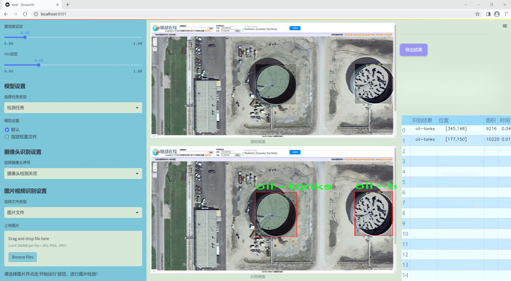
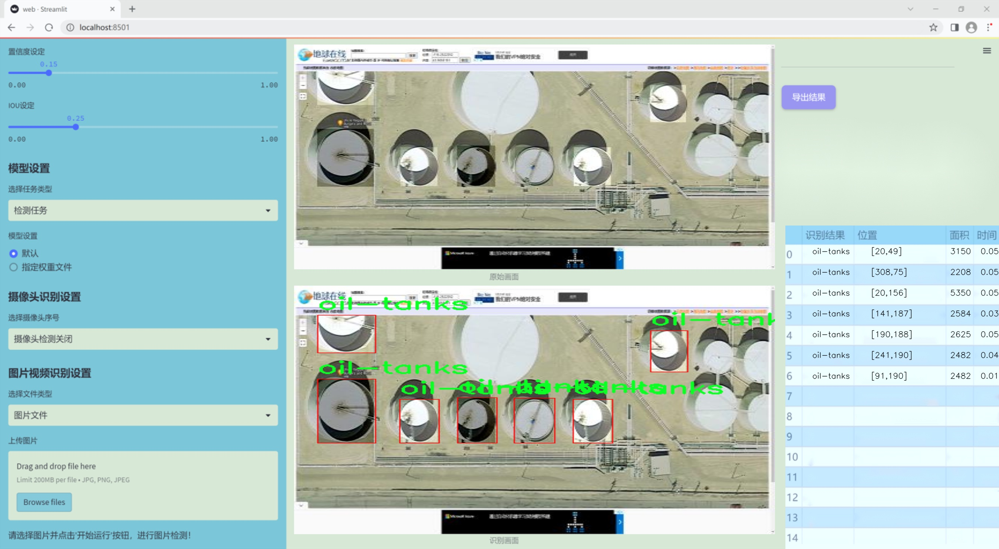
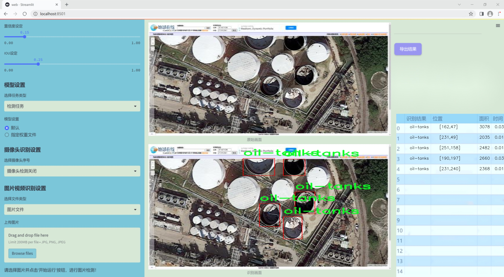
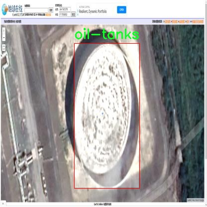
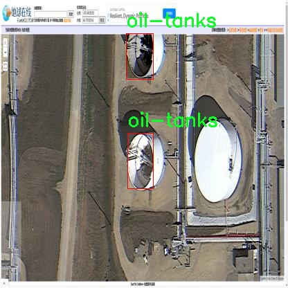
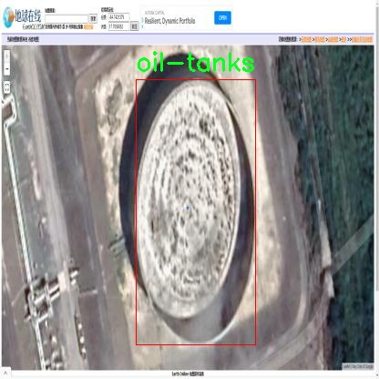
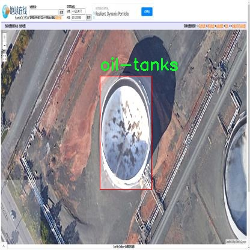
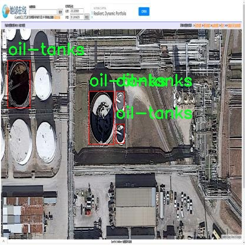

# 改进yolo11-RVB-EMA等200+全套创新点大全：遥感图油罐检测系统源码＆数据集全套

### 1.图片效果展示







##### 项目来源 **[人工智能促进会 2024.11.01](https://kdocs.cn/l/cszuIiCKVNis)**

注意：由于项目一直在更新迭代，上面“1.图片效果展示”和“2.视频效果展示”展示的系统图片或者视频可能为老版本，新版本在老版本的基础上升级如下：（实际效果以升级的新版本为准）

  （1）适配了YOLOV11的“目标检测”模型和“实例分割”模型，通过加载相应的权重（.pt）文件即可自适应加载模型。

  （2）支持“图片识别”、“视频识别”、“摄像头实时识别”三种识别模式。

  （3）支持“图片识别”、“视频识别”、“摄像头实时识别”三种识别结果保存导出，解决手动导出（容易卡顿出现爆内存）存在的问题，识别完自动保存结果并导出到tempDir中。

  （4）支持Web前端系统中的标题、背景图等自定义修改。

  另外本项目提供训练的数据集和训练教程,暂不提供权重文件（best.pt）,需要您按照教程进行训练后实现图片演示和Web前端界面演示的效果。

### 2.视频效果展示

[2.1 视频效果展示](https://www.bilibili.com/video/BV1zwSdYXET9/)

### 3.背景

研究背景与意义

随着城市化进程的加快和工业活动的增加，油罐作为重要的能源储存设施，其安全性和环境影响日益受到关注。油罐的泄漏、腐蚀及其他安全隐患不仅可能导致严重的经济损失，还可能对周围环境造成不可逆转的破坏。因此，及时、准确地检测油罐的状态和位置，成为了保障公共安全和环境保护的重要任务。传统的油罐检测方法往往依赖人工巡检，不仅效率低下，而且容易受到人为因素的影响，难以保证检测的全面性和准确性。

近年来，随着遥感技术和深度学习的迅猛发展，基于计算机视觉的自动化检测方法逐渐成为研究热点。YOLO（You Only Look Once）系列模型因其高效的实时目标检测能力，已被广泛应用于各类物体检测任务中。然而，现有的YOLO模型在特定领域的应用中仍存在一定的局限性，尤其是在复杂背景下的油罐检测任务中，识别精度和鲁棒性亟待提升。因此，基于改进YOLOv11的遥感图油罐检测系统的研究具有重要的现实意义。

本项目旨在利用改进的YOLOv11模型，结合遥感图像的特点，构建一个高效、准确的油罐检测系统。我们将使用包含475幅图像的油罐数据集，该数据集涵盖了三类不同的油罐，能够为模型的训练和测试提供丰富的样本支持。通过对YOLOv11模型的改进，我们期望在提高检测精度的同时，增强模型对不同环境和条件下油罐的适应能力。最终，本研究不仅将为油罐的安全监测提供一种新的技术手段，也将为相关领域的研究提供有价值的参考和借鉴。

### 4.数据集信息展示

##### 4.1 本项目数据集详细数据（类别数＆类别名）

nc: 1
names: ['oil-tanks']


该项目为【目标检测】数据集，请在【训练教程和Web端加载模型教程（第三步）】这一步的时候按照【目标检测】部分的教程来训练

##### 4.2 本项目数据集信息介绍

本项目数据集信息介绍

本项目所使用的数据集名为“Oil Tanks”，专门用于训练和改进YOLOv11模型，以实现高效的遥感图像中油罐的检测。该数据集的设计旨在提供丰富的图像样本，以便模型能够在各种环境条件下准确识别油罐。数据集中包含的类别数量为1，具体类别为“oil-tanks”，这意味着所有的图像样本均围绕这一特定目标展开，确保模型在训练过程中能够专注于油罐的特征提取和分类。

“Oil Tanks”数据集的图像来源广泛，涵盖了不同地理位置、季节和光照条件下的油罐图像。这种多样性不仅增强了数据集的代表性，也提高了模型在实际应用中的鲁棒性。数据集中包含的图像分辨率各异，确保了模型能够适应不同分辨率的遥感图像，从而在实际应用中能够更好地处理来自卫星或无人机的图像数据。

为了提高模型的检测精度，数据集还经过精心标注，确保每个油罐在图像中都被准确框定。标注信息的准确性对于训练过程至关重要，它直接影响到模型的学习效果和最终的检测性能。此外，数据集的构建遵循了严格的数据采集和处理标准，以确保数据的质量和可靠性。

通过使用“Oil Tanks”数据集，本项目旨在推动遥感图像分析领域的发展，特别是在油罐检测这一特定应用场景中的表现。最终目标是实现一个高效、准确的油罐检测系统，为环境监测、资源管理等领域提供强有力的技术支持。











### 5.全套项目环境部署视频教程（零基础手把手教学）

[5.1 所需软件PyCharm和Anaconda安装教程（第一步）](https://www.bilibili.com/video/BV1BoC1YCEKi/?spm_id_from=333.999.0.0&vd_source=bc9aec86d164b67a7004b996143742dc)


[5.2 安装Python虚拟环境创建和依赖库安装视频教程（第二步）](https://www.bilibili.com/video/BV1ZoC1YCEBw?spm_id_from=333.788.videopod.sections&vd_source=bc9aec86d164b67a7004b996143742dc)

### 6.改进YOLOv11训练教程和Web_UI前端加载模型教程（零基础手把手教学）

[6.1 改进YOLOv11训练教程和Web_UI前端加载模型教程（第三步）](https://www.bilibili.com/video/BV1BoC1YCEhR?spm_id_from=333.788.videopod.sections&vd_source=bc9aec86d164b67a7004b996143742dc)


按照上面的训练视频教程链接加载项目提供的数据集，运行train.py即可开始训练



     Epoch   gpu_mem       box       obj       cls    labels  img_size
     1/200     20.8G   0.01576   0.01955  0.007536        22      1280: 100%|██████████| 849/849 [14:42<00:00,  1.04s/it]
               Class     Images     Labels          P          R     mAP@.5 mAP@.5:.95: 100%|██████████| 213/213 [01:14<00:00,  2.87it/s]
                 all       3395      17314      0.994      0.957      0.0957      0.0843

     Epoch   gpu_mem       box       obj       cls    labels  img_size
     2/200     20.8G   0.01578   0.01923  0.007006        22      1280: 100%|██████████| 849/849 [14:44<00:00,  1.04s/it]
               Class     Images     Labels          P          R     mAP@.5 mAP@.5:.95: 100%|██████████| 213/213 [01:12<00:00,  2.95it/s]
                 all       3395      17314      0.996      0.956      0.0957      0.0845

     Epoch   gpu_mem       box       obj       cls    labels  img_size
     3/200     20.8G   0.01561    0.0191  0.006895        27      1280: 100%|██████████| 849/849 [10:56<00:00,  1.29it/s]
               Class     Images     Labels          P          R     mAP@.5 mAP@.5:.95: 100%|███████   | 187/213 [00:52<00:00,  4.04it/s]
                 all       3395      17314      0.996      0.957      0.0957      0.0845


###### [项目数据集下载链接](https://kdocs.cn/l/cszuIiCKVNis)

### 7.原始YOLOv11算法讲解


##### YOLOv11三大损失函数

YOLOv11（You Only Look Once）是一种流行的目标检测算法，其损失函数设计用于同时优化分类和定位任务。YOLO的损失函数通常包括几个部分：
**分类损失、定位损失（边界框回归损失）和置信度损失** 。其中，

  1. box_loss（边界框回归损失）是用于优化预测边界框与真实边界框之间的差异的部分。

  2. cls_loss（分类损失）是用于优化模型对目标类别的预测准确性的部分。分类损失确保模型能够正确地识别出图像中的对象属于哪个类别。

  3. dfl_loss（Distribution Focal Loss）是YOLO系列中的一种损失函数，特别是在一些改进版本如YOLOv5和YOLOv7中被引入。它的主要目的是解决目标检测中的类别不平衡问题，并提高模型在处理小目标和困难样本时的性能。

##### 边界框回归损失详解

box_loss（边界框回归损失）是用于优化预测边界框与真实边界框之间的差异的部分。


##### box_loss 的具体意义


##### 为什么需要 box_loss

  * 精确定位：通过最小化中心点坐标损失和宽高损失，模型能够更准确地预测目标的位置和大小。
  * 平衡不同类型的目标：使用平方根来处理宽高损失，可以更好地平衡不同大小的目标，确保小目标也能得到足够的关注。
  * 稳定训练：适当的损失函数设计有助于模型的稳定训练，避免梯度爆炸或消失等问题。

##### 分类损失详解

在YOLO（You Only Look
Once）目标检测算法中，cls_loss（分类损失）是用于优化模型对目标类别的预测准确性的部分。分类损失确保模型能够正确地识别出图像中的对象属于哪个类别。下面是关于cls_loss的详细解读：

##### 分类损失 (cls_loss) 的具体意义

  
分类损失通常使用交叉熵损失（Cross-Entropy
Loss）来计算。交叉熵损失衡量的是模型预测的概率分布与真实标签之间的差异。在YOLO中，分类损失的具体形式如下：


##### 为什么需要 cls_loss

  * 类别识别：cls_loss 确保模型能够正确识别出图像中的目标属于哪个类别。这对于目标检测任务至关重要，因为不仅需要知道目标的位置，还需要知道目标的类型。

  * 多类别支持：通过最小化分类损失，模型可以处理多个类别的目标检测任务。例如，在道路缺陷检测中，可能需要识别裂缝、坑洞、路面破损等多种类型的缺陷。

  * 提高准确性：分类损失有助于提高模型的分类准确性，从而提升整体检测性能。通过优化分类损失，模型可以更好地学习不同类别之间的特征差异。

##### 分布损失详解

`dfl_loss`（Distribution Focal
Loss）是YOLO系列中的一种损失函数，特别是在一些改进版本如YOLOv5和YOLOv7中被引入。它的主要目的是解决目标检测中的类别不平衡问题，并提高模型在处理小目标和困难样本时的性能。下面是对`dfl_loss`的详细解读：

##### DFL Loss 的背景

在目标检测任务中，类别不平衡是一个常见的问题。某些类别的样本数量可能远远多于其他类别，这会导致模型在训练过程中对常见类别的学习效果较好，而对罕见类别的学习效果较差。此外，小目标和困难样本的检测也是一个挑战，因为这些目标通常具有较少的特征信息，容易被忽略或误分类。

为了应对这些问题，研究者们提出了多种改进方法，其中之一就是`dfl_loss`。`dfl_loss`通过引入分布焦点损失来增强模型对困难样本的关注，并改善类别不平衡问题。

##### DFL Loss 的定义

DFL Loss
通常与传统的交叉熵损失结合使用，以增强模型对困难样本的学习能力。其核心思想是通过对每个类别的预测概率进行加权，使得模型更加关注那些难以正确分类的样本。

DFL Loss 的公式可以表示为：


##### DFL Loss 的具体意义**

  * **类别不平衡：** 通过引入平衡因子 α，DFL Loss 可以更好地处理类别不平衡问题。对于少数类别的样本，可以通过增加其权重来提升其重要性，从而提高模型对这些类别的检测性能。
  *  **困难样本：** 通过聚焦参数 γ，DFL Loss 可以让模型更加关注那些难以正确分类的样本。当 
  * γ 较大时，模型会对那些预测概率较低的样本给予更多的关注，从而提高这些样本的分类准确性。
  *  **提高整体性能** ：DFL Loss 结合了传统交叉熵损失的优势，并通过加权机制增强了模型对困难样本的学习能力，从而提高了整体的检测性能。


### 8.200+种全套改进YOLOV11创新点原理讲解

#### 8.1 200+种全套改进YOLOV11创新点原理讲解大全

由于篇幅限制，每个创新点的具体原理讲解就不全部展开，具体见下列网址中的改进模块对应项目的技术原理博客网址【Blog】（创新点均为模块化搭建，原理适配YOLOv5~YOLOv11等各种版本）

[改进模块技术原理博客【Blog】网址链接](https://gitee.com/qunmasj/good)


#### 8.2 精选部分改进YOLOV11创新点原理讲解

###### 这里节选部分改进创新点展开原理讲解(完整的改进原理见上图和[改进模块技术原理博客链接](https://gitee.com/qunmasj/good)【如果此小节的图加载失败可以通过CSDN或者Github搜索该博客的标题访问原始博客，原始博客图片显示正常】
### CBAM空间注意力机制
近年来，随着深度学习研究方向的火热，注意力机制也被广泛地应用在图像识别、语音识别和自然语言处理等领域，注意力机制在深度学习任务中发挥着举足轻重的作用。注意力机制借鉴于人类的视觉系统，例如，人眼在看到一幅画面时，会倾向于关注画面中的重要信息，而忽略其他可见的信息。深度学习中的注意力机制和人类视觉的注意力机制相似，通过扫描全局数据，从大量数据中选择出需要重点关注的、对当前任务更为重要的信息，然后对这部分信息分配更多的注意力资源，从这些信息中获取更多所需要的细节信息，而抑制其他无用的信息。而在深度学习中，则具体表现为给感兴趣的区域更高的权重，经过网络的学习和调整，得到最优的权重分配，形成网络模型的注意力，使网络拥有更强的学习能力，加快网络的收敛速度。
注意力机制通常可分为软注意力机制和硬注意力机制[4-5]。软注意力机制在选择信息时，不是从输入的信息中只选择1个，而会用到所有输入信息，只是各个信息对应的权重分配不同，然后输入网络模型进行计算;硬注意力机制则是从输入的信息中随机选取一个或者选择概率最高的信息，但是这一步骤通常是不可微的，导致硬注意力机制更难训练。因此，软注意力机制应用更为广泛，按照原理可将软注意力机制划分为:通道注意力机制（channel attention)、空间注意力机制(spatial attention）和混合域注意力机制(mixed attention)。
通道注意力机制的本质建立各个特征通道之间的重要程度，对感兴趣的通道进行重点关注，弱化不感兴趣的通道的作用;空间注意力的本质则是建模了整个空间信息的重要程度，然后对空间内感兴趣的区域进行重点关注，弱化其余非感兴趣区域的作用;混合注意力同时运用了通道注意力和空间注意力，两部分先后进行或并行，形成对通道特征和空间特征同时关注的注意力模型。

卷积层注意力模块(Convolutional Block Attention Module，CBAM）是比较常用的混合注意力模块，其先后集中了通道注意力模块和空间注意力模块，网络中加入该模块能有效提高网络性能，减少网络模型的计算量，模块结构如图所示。输入特征图首先经过分支的通道注意力模块，然后和主干的原特征图融合，得到具有通道注意力的特征图，接着经过分支的空间注意力模块，在和主干的特征图融合后，得到同时具有通道特征注意力和空间特征注意力的特征图。CBAM模块不改变输入特征图的大小，因此该模块是一个“即插即用”的模块，可以插入网络的任何位置。

通道注意力模块的结构示意图如图所示，通道注意力模块分支并行地对输入的特征图进行最大池化操作和平均池化操作，然后利用多层感知机对结果进行变换，得到应用于两个通道的变换结果，最后经过sigmoid激活函数将变换结果融合，得到具有通道注意力的通道特征图。

空间注意力模块示意图如图所示，将通道注意力模块输出的特征图作为该模块的输入特征图，首先对输入特征图进行基于通道的最大池化操作和平均池化操作，将两部分得到的结果拼接起来，然后通过卷积得到降为Ⅰ通道的特征图，最后通过sigmoid激活函数生成具有空间注意力的特征图。


### 9.系统功能展示

图9.1.系统支持检测结果表格显示

  图9.2.系统支持置信度和IOU阈值手动调节

  图9.3.系统支持自定义加载权重文件best.pt(需要你通过步骤5中训练获得)

  图9.4.系统支持摄像头实时识别

  图9.5.系统支持图片识别

  图9.6.系统支持视频识别

  图9.7.系统支持识别结果文件自动保存

  图9.8.系统支持Excel导出检测结果数据


### 10. YOLOv11核心改进源码讲解

#### 10.1 kaln_conv.py

以下是对给定代码的核心部分进行分析和详细注释的结果。代码主要实现了一个多维卷积层（KALNConvNDLayer）及其一维、二维和三维的具体实现。该层结合了卷积操作和Legendre多项式的计算，具有一定的复杂性。

```python
from functools import lru_cache
import torch
import torch.nn as nn
from torch.nn.functional import conv3d, conv2d, conv1d

class KALNConvNDLayer(nn.Module):
    def __init__(self, conv_class, norm_class, conv_w_fun, input_dim, output_dim, degree, kernel_size,
                 groups=1, padding=0, stride=1, dilation=1, dropout: float = 0.0, ndim: int = 2):
        super(KALNConvNDLayer, self).__init__()
        
        # 初始化参数
        self.inputdim = input_dim  # 输入维度
        self.outdim = output_dim    # 输出维度
        self.degree = degree         # Legendre多项式的阶数
        self.kernel_size = kernel_size  # 卷积核大小
        self.padding = padding       # 填充
        self.stride = stride         # 步幅
        self.dilation = dilation     # 膨胀
        self.groups = groups         # 分组卷积的组数
        self.base_activation = nn.SiLU()  # 基础激活函数
        self.conv_w_fun = conv_w_fun  # 卷积权重函数
        self.ndim = ndim             # 数据的维度
        self.dropout = None          # Dropout层

        # 根据输入的dropout值初始化Dropout层
        if dropout > 0:
            if ndim == 1:
                self.dropout = nn.Dropout1d(p=dropout)
            elif ndim == 2:
                self.dropout = nn.Dropout2d(p=dropout)
            elif ndim == 3:
                self.dropout = nn.Dropout3d(p=dropout)

        # 检查分组卷积的有效性
        if groups <= 0:
            raise ValueError('groups must be a positive integer')
        if input_dim % groups != 0:
            raise ValueError('input_dim must be divisible by groups')
        if output_dim % groups != 0:
            raise ValueError('output_dim must be divisible by groups')

        # 初始化卷积层和归一化层
        self.base_conv = nn.ModuleList([conv_class(input_dim // groups,
                                                   output_dim // groups,
                                                   kernel_size,
                                                   stride,
                                                   padding,
                                                   dilation,
                                                   groups=1,
                                                   bias=False) for _ in range(groups)])

        self.layer_norm = nn.ModuleList([norm_class(output_dim // groups) for _ in range(groups)])

        # 初始化多项式权重
        poly_shape = (groups, output_dim // groups, (input_dim // groups) * (degree + 1)) + tuple(
            kernel_size for _ in range(ndim))
        self.poly_weights = nn.Parameter(torch.randn(*poly_shape))

        # 使用Kaiming均匀分布初始化卷积层和多项式权重
        for conv_layer in self.base_conv:
            nn.init.kaiming_uniform_(conv_layer.weight, nonlinearity='linear')
        nn.init.kaiming_uniform_(self.poly_weights, nonlinearity='linear')

    @lru_cache(maxsize=128)  # 使用LRU缓存避免重复计算Legendre多项式
    def compute_legendre_polynomials(self, x, order):
        # 计算Legendre多项式
        P0 = x.new_ones(x.shape)  # P0 = 1
        if order == 0:
            return P0.unsqueeze(-1)
        P1 = x  # P1 = x
        legendre_polys = [P0, P1]

        # 递归计算高阶多项式
        for n in range(1, order):
            Pn = ((2.0 * n + 1.0) * x * legendre_polys[-1] - n * legendre_polys[-2]) / (n + 1.0)
            legendre_polys.append(Pn)

        return torch.concatenate(legendre_polys, dim=1)

    def forward_kal(self, x, group_index):
        # 前向传播过程
        base_output = self.base_conv[group_index](x)  # 基础卷积输出

        # 归一化输入以稳定Legendre多项式计算
        x_normalized = 2 * (x - x.min()) / (x.max() - x.min()) - 1 if x.shape[0] > 0 else x

        if self.dropout is not None:
            x_normalized = self.dropout(x_normalized)  # 应用Dropout

        # 计算Legendre多项式
        legendre_basis = self.compute_legendre_polynomials(x_normalized, self.degree)
        # 使用多项式权重进行卷积
        poly_output = self.conv_w_fun(legendre_basis, self.poly_weights[group_index],
                                      stride=self.stride, dilation=self.dilation,
                                      padding=self.padding, groups=1)

        # 合并基础输出和多项式输出
        x = base_output + poly_output
        if isinstance(self.layer_norm[group_index], nn.LayerNorm):
            orig_shape = x.shape
            x = self.layer_norm[group_index](x.view(orig_shape[0], -1)).view(orig_shape)
        else:
            x = self.layer_norm[group_index](x)
        x = self.base_activation(x)  # 应用激活函数

        return x

    def forward(self, x):
        # 前向传播
        split_x = torch.split(x, self.inputdim // self.groups, dim=1)  # 按组分割输入
        output = []
        for group_ind, _x in enumerate(split_x):
            y = self.forward_kal(_x.clone(), group_ind)  # 对每个组进行前向传播
            output.append(y.clone())
        y = torch.cat(output, dim=1)  # 合并所有组的输出
        return y

# KALNConv3DLayer, KALNConv2DLayer, KALNConv1DLayer类继承自KALNConvNDLayer，分别实现三维、二维和一维卷积层
class KALNConv3DLayer(KALNConvNDLayer):
    def __init__(self, input_dim, output_dim, kernel_size, degree=3, groups=1, padding=0, stride=1, dilation=1,
                 dropout: float = 0.0):
        super(KALNConv3DLayer, self).__init__(nn.Conv3d, nn.InstanceNorm3d, conv3d,
                                              input_dim, output_dim,
                                              degree, kernel_size,
                                              groups=groups, padding=padding, stride=stride, dilation=dilation,
                                              ndim=3, dropout=dropout)

class KALNConv2DLayer(KALNConvNDLayer):
    def __init__(self, input_dim, output_dim, kernel_size, degree=3, groups=1, padding=0, stride=1, dilation=1,
                 dropout: float = 0.0, norm_layer=nn.InstanceNorm2d):
        super(KALNConv2DLayer, self).__init__(nn.Conv2d, norm_layer, conv2d,
                                              input_dim, output_dim,
                                              degree, kernel_size,
                                              groups=groups, padding=padding, stride=stride, dilation=dilation,
                                              ndim=2, dropout=dropout)

class KALNConv1DLayer(KALNConvNDLayer):
    def __init__(self, input_dim, output_dim, kernel_size, degree=3, groups=1, padding=0, stride=1, dilation=1,
                 dropout: float = 0.0):
        super(KALNConv1DLayer, self).__init__(nn.Conv1d, nn.InstanceNorm1d, conv1d,
                                              input_dim, output_dim,
                                              degree, kernel_size,
                                              groups=groups, padding=padding, stride=stride, dilation=dilation,
                                              ndim=1, dropout=dropout)
```

### 代码核心部分分析：
1. **KALNConvNDLayer**：这是一个通用的多维卷积层，支持一维、二维和三维卷积。它使用Legendre多项式进行特征提取，并结合基础卷积操作和归一化层。
2. **构造函数**：初始化卷积层、归一化层和多项式权重，并检查输入参数的有效性。
3. **compute_legendre_polynomials**：计算Legendre多项式，使用LRU缓存以提高效率。
4. **forward_kal**：实现了前向传播逻辑，计算基础卷积输出和多项式输出，并进行合并和激活。
5. **forward**：对输入进行分组处理，调用`forward_kal`进行前向传播，并将结果合并。

### 具体实现类：
- **KALNConv3DLayer**、**KALNConv2DLayer**、**KALNConv1DLayer**：分别为三维、二维和一维卷积层的具体实现，继承自`KALNConvNDLayer`，通过传递不同的卷积类和归一化类来实现不同维度的卷积操作。

这个文件定义了一个用于实现KALN（Kernels with Adaptive Legendre Normalization）卷积层的PyTorch模块，支持1D、2D和3D卷积。文件中主要包含一个基类`KALNConvNDLayer`，以及三个继承自该基类的具体实现类：`KALNConv1DLayer`、`KALNConv2DLayer`和`KALNConv3DLayer`。

在`KALNConvNDLayer`类的构造函数中，首先初始化了一些卷积层所需的参数，包括输入和输出维度、卷积核大小、步幅、填充、扩张、分组等。该类使用了PyTorch的`nn.ModuleList`来创建多个卷积层和归一化层，支持分组卷积。卷积层的权重和多项式权重被初始化为Kaiming均匀分布，以便在训练开始时具有更好的性能。

该类还定义了一个用于计算勒让德多项式的缓存方法`compute_legendre_polynomials`，该方法使用递归关系计算指定阶数的勒让德多项式，并将结果存储在缓存中以避免重复计算。`forward_kal`方法实现了前向传播过程，其中包括对输入进行基激活、归一化、勒让德多项式计算和最终的输出组合。

在`forward`方法中，输入张量被分割成多个组，并对每个组调用`forward_kal`进行处理，最后将所有组的输出拼接在一起。

具体的1D、2D和3D卷积层类分别通过调用基类的构造函数来初始化相应的卷积和归一化层。每个类都指定了对应的卷积类型（`nn.Conv1d`、`nn.Conv2d`、`nn.Conv3d`）和归一化类型（`nn.InstanceNorm1d`、`nn.InstanceNorm2d`、`nn.InstanceNorm3d`），使得这些类可以灵活地用于不同维度的卷积操作。

整体来看，这个文件实现了一个具有灵活性和可扩展性的卷积层设计，结合了勒让德多项式的特性，以增强卷积操作的表现。

#### 10.2 UniRepLKNet.py

以下是经过简化并注释的核心代码部分，主要包括`UniRepLKNet`模型的定义和一些关键组件的实现。

```python
import torch
import torch.nn as nn
import torch.nn.functional as F
from timm.layers import trunc_normal_, DropPath, to_2tuple

class GRNwithNHWC(nn.Module):
    """ GRN (Global Response Normalization) 层
    该层用于对输入进行全局响应归一化，输入假设为 (N, H, W, C) 格式。
    """
    def __init__(self, dim, use_bias=True):
        super().__init__()
        self.use_bias = use_bias
        self.gamma = nn.Parameter(torch.zeros(1, 1, 1, dim))  # 归一化参数
        if self.use_bias:
            self.beta = nn.Parameter(torch.zeros(1, 1, 1, dim))  # 偏置参数

    def forward(self, x):
        Gx = torch.norm(x, p=2, dim=(1, 2), keepdim=True)  # 计算L2范数
        Nx = Gx / (Gx.mean(dim=-1, keepdim=True) + 1e-6)  # 归一化
        if self.use_bias:
            return (self.gamma * Nx + 1) * x + self.beta  # 应用归一化和偏置
        else:
            return (self.gamma * Nx + 1) * x

class UniRepLKNetBlock(nn.Module):
    """ UniRepLKNet中的基本模块
    该模块包括深度卷积、归一化、Squeeze-and-Excitation (SE) 块和前馈网络。
    """
    def __init__(self, dim, kernel_size, drop_path=0., deploy=False, use_sync_bn=False):
        super().__init__()
        self.dwconv = nn.Conv2d(dim, dim, kernel_size=kernel_size, stride=1, padding=kernel_size // 2, groups=dim)  # 深度卷积
        self.norm = nn.BatchNorm2d(dim) if not deploy else nn.Identity()  # 归一化层
        self.se = SEBlock(dim, dim // 4)  # Squeeze-and-Excitation块

        ffn_dim = dim * 4  # 前馈网络的维度
        self.pwconv1 = nn.Linear(dim, ffn_dim)  # 第一层前馈网络
        self.act = nn.GELU()  # 激活函数
        self.pwconv2 = nn.Linear(ffn_dim, dim)  # 第二层前馈网络

        self.drop_path = DropPath(drop_path) if drop_path > 0. else nn.Identity()  # 随机深度

    def forward(self, inputs):
        """ 前向传播函数 """
        x = self.dwconv(inputs)  # 深度卷积
        x = self.norm(x)  # 归一化
        x = self.se(x)  # Squeeze-and-Excitation
        x = self.pwconv1(x)  # 前馈网络第一层
        x = self.act(x)  # 激活
        x = self.pwconv2(x)  # 前馈网络第二层
        return self.drop_path(x) + inputs  # 残差连接

class UniRepLKNet(nn.Module):
    """ UniRepLKNet模型的实现 """
    def __init__(self, in_chans=3, num_classes=1000, depths=(3, 3, 27, 3), dims=(96, 192, 384, 768)):
        super().__init__()
        self.stages = nn.ModuleList()  # 存储各个阶段的模块
        for i in range(len(depths)):
            stage = nn.Sequential(
                *[UniRepLKNetBlock(dim=dims[i], kernel_size=3) for _ in range(depths[i])]
            )
            self.stages.append(stage)

    def forward(self, x):
        """ 前向传播函数 """
        for stage in self.stages:
            x = stage(x)  # 通过每个阶段
        return x

# 实例化模型并进行测试
if __name__ == '__main__':
    inputs = torch.randn((1, 3, 640, 640))  # 输入张量
    model = UniRepLKNet()  # 创建模型实例
    res = model(inputs)  # 前向传播
    print(res.shape)  # 输出结果的形状
```

### 代码注释说明：
1. **GRNwithNHWC**: 实现了全局响应归一化层，主要用于对输入进行归一化处理。
2. **UniRepLKNetBlock**: 这是UniRepLKNet的基本构建块，包含深度卷积、归一化、Squeeze-and-Excitation块和前馈网络，支持残差连接。
3. **UniRepLKNet**: 该类定义了整个模型结构，由多个`UniRepLKNetBlock`组成，支持多阶段的特征提取。
4. **前向传播**: 在`forward`方法中，输入数据通过各个模块进行处理，最终输出特征。

以上代码是对原始代码的简化版本，保留了核心功能并进行了详细注释。

这个程序文件实现了一个名为UniRepLKNet的深度学习模型，主要用于音频、视频、点云、时间序列和图像识别等任务。它是基于多个已有的模型架构（如RepLKNet、ConvNeXt、DINO和DeiT）进行开发的，旨在提供一种通用的感知能力。

程序首先导入了必要的库，包括PyTorch和一些特定的模块。接着定义了一些辅助类和函数，例如GRNwithNHWC（全局响应归一化层）、NCHWtoNHWC和NHWCtoNCHW（用于不同数据格式之间的转换），以及一些卷积和归一化的辅助函数。

在模型的核心部分，定义了DilatedReparamBlock和UniRepLKNetBlock类。DilatedReparamBlock实现了膨胀卷积的重参数化，允许在推理时合并多个卷积层以提高效率。UniRepLKNetBlock则是UniRepLKNet的基本构建块，结合了深度卷积、归一化、激活函数和Squeeze-and-Excitation（SE）模块，以增强特征表示能力。

UniRepLKNet类是整个模型的主类，构造函数中接受多个参数，如输入通道数、类别数、每个阶段的深度和特征维度等。它根据这些参数构建了多个下采样层和主阶段，每个阶段由多个UniRepLKNetBlock组成。模型还支持不同的输出模式（如特征提取或分类），并提供了权重初始化的方法。

在文件的最后部分，定义了一些函数（如unireplknet_a、unireplknet_f等），用于创建不同配置的UniRepLKNet模型，并可选择加载预训练权重。主程序部分展示了如何实例化模型并进行推理。

总的来说，这个程序文件提供了一个灵活且高效的深度学习模型实现，适用于多种视觉和听觉任务，具有较强的扩展性和可配置性。

#### 10.3 convnextv2.py

以下是代码中最核心的部分，并附上详细的中文注释：

```python
import torch
import torch.nn as nn
import torch.nn.functional as F

class LayerNorm(nn.Module):
    """ 
    自定义的LayerNorm层，支持两种数据格式：channels_last（默认）或 channels_first。
    channels_last对应的输入形状为 (batch_size, height, width, channels)，
    而channels_first对应的输入形状为 (batch_size, channels, height, width)。
    """
    def __init__(self, normalized_shape, eps=1e-6, data_format="channels_last"):
        super().__init__()
        # 权重和偏置参数
        self.weight = nn.Parameter(torch.ones(normalized_shape))
        self.bias = nn.Parameter(torch.zeros(normalized_shape))
        self.eps = eps
        self.data_format = data_format
        if self.data_format not in ["channels_last", "channels_first"]:
            raise NotImplementedError 
        self.normalized_shape = (normalized_shape, )
    
    def forward(self, x):
        # 根据数据格式选择不同的归一化方式
        if self.data_format == "channels_last":
            return F.layer_norm(x, self.normalized_shape, self.weight, self.bias, self.eps)
        elif self.data_format == "channels_first":
            u = x.mean(1, keepdim=True)  # 计算均值
            s = (x - u).pow(2).mean(1, keepdim=True)  # 计算方差
            x = (x - u) / torch.sqrt(s + self.eps)  # 标准化
            x = self.weight[:, None, None] * x + self.bias[:, None, None]  # 应用权重和偏置
            return x

class Block(nn.Module):
    """ 
    ConvNeXtV2的基本模块，包含深度可分离卷积、归一化、激活函数等。
    
    Args:
        dim (int): 输入通道数。
        drop_path (float): 随机深度率。默认值为0.0。
    """
    def __init__(self, dim, drop_path=0.):
        super().__init__()
        # 深度可分离卷积
        self.dwconv = nn.Conv2d(dim, dim, kernel_size=7, padding=3, groups=dim)
        self.norm = LayerNorm(dim, eps=1e-6)  # 归一化层
        self.pwconv1 = nn.Linear(dim, 4 * dim)  # 1x1卷积，使用线性层实现
        self.act = nn.GELU()  # 激活函数
        self.pwconv2 = nn.Linear(4 * dim, dim)  # 另一个1x1卷积
        self.drop_path = nn.Identity() if drop_path <= 0. else DropPath(drop_path)  # 随机深度

    def forward(self, x):
        input = x  # 保存输入以便后续残差连接
        x = self.dwconv(x)  # 深度可分离卷积
        x = x.permute(0, 2, 3, 1)  # 转换维度
        x = self.norm(x)  # 归一化
        x = self.pwconv1(x)  # 1x1卷积
        x = self.act(x)  # 激活
        x = self.pwconv2(x)  # 另一个1x1卷积
        x = x.permute(0, 3, 1, 2)  # 恢复维度

        x = input + self.drop_path(x)  # 残差连接
        return x

class ConvNeXtV2(nn.Module):
    """ 
    ConvNeXt V2模型定义。
    
    Args:
        in_chans (int): 输入图像的通道数。默认值为3。
        num_classes (int): 分类头的类别数。默认值为1000。
        depths (tuple(int)): 每个阶段的块数。默认值为[3, 3, 9, 3]。
        dims (int): 每个阶段的特征维度。默认值为[96, 192, 384, 768]。
        drop_path_rate (float): 随机深度率。默认值为0。
    """
    def __init__(self, in_chans=3, num_classes=1000, 
                 depths=[3, 3, 9, 3], dims=[96, 192, 384, 768], 
                 drop_path_rate=0.):
        super().__init__()
        self.downsample_layers = nn.ModuleList()  # 下采样层
        # 初始化stem层
        stem = nn.Sequential(
            nn.Conv2d(in_chans, dims[0], kernel_size=4, stride=4),
            LayerNorm(dims[0], eps=1e-6, data_format="channels_first")
        )
        self.downsample_layers.append(stem)
        # 添加下采样层
        for i in range(3):
            downsample_layer = nn.Sequential(
                    LayerNorm(dims[i], eps=1e-6, data_format="channels_first"),
                    nn.Conv2d(dims[i], dims[i+1], kernel_size=2, stride=2),
            )
            self.downsample_layers.append(downsample_layer)

        self.stages = nn.ModuleList()  # 特征分辨率阶段
        dp_rates = [x.item() for x in torch.linspace(0, drop_path_rate, sum(depths))] 
        cur = 0
        # 添加多个Block到每个阶段
        for i in range(4):
            stage = nn.Sequential(
                *[Block(dim=dims[i], drop_path=dp_rates[cur + j]) for j in range(depths[i])]
            )
            self.stages.append(stage)
            cur += depths[i]

        self.norm = nn.LayerNorm(dims[-1], eps=1e-6)  # 最后的归一化层
        self.head = nn.Linear(dims[-1], num_classes)  # 分类头

    def forward(self, x):
        for i in range(4):
            x = self.downsample_layers[i](x)  # 下采样
            x = self.stages[i](x)  # 通过阶段
        return x  # 返回最后的特征图
```

以上代码实现了ConvNeXtV2模型的基本结构，包括LayerNorm、Block和ConvNeXtV2类的定义，核心在于深度可分离卷积、归一化和残差连接的实现。

这个程序文件实现了ConvNeXt V2模型的定义，主要用于图像分类任务。首先，文件中引入了必要的库，包括PyTorch和一些自定义的层。接下来，定义了一些基础的层和模块。

首先是`LayerNorm`类，它实现了层归一化（Layer Normalization），支持两种数据格式：通道在最后（channels_last）和通道在最前（channels_first）。该类的构造函数接受归一化的形状、一个小的常数用于数值稳定性以及数据格式。在前向传播中，根据输入数据的格式应用相应的归一化操作。

接下来是`GRN`类，表示全局响应归一化（Global Response Normalization）层。它通过计算输入的L2范数来调整输入的响应，增强模型的表现。

然后是`Block`类，表示ConvNeXt V2的基本构建块。它包含一个深度可分离卷积层、层归一化、两个逐点卷积层（使用线性层实现）、激活函数（GELU）和GRN层。这个模块的前向传播过程包括对输入进行卷积、归一化、激活和再次卷积，并且通过残差连接将输入与输出相加。

`ConvNeXtV2`类是整个模型的核心。它的构造函数接受输入通道数、分类头的类别数、每个阶段的块数、每个阶段的特征维度、随机深度率等参数。模型由一个初始卷积层和多个下采样层组成，每个阶段由多个`Block`组成。最后，模型通过一个层归一化层和一个线性层作为分类头。模型的权重通过`_init_weights`方法进行初始化。

文件还定义了一个`update_weight`函数，用于更新模型的权重字典，确保加载的权重与模型结构匹配。最后，提供了一系列函数（如`convnextv2_atto`、`convnextv2_femto`等），用于创建不同规模的ConvNeXt V2模型，并可选择性地加载预训练权重。

总体来说，这个文件实现了一个灵活且可扩展的卷积神经网络架构，适用于各种图像分类任务。

#### 10.4 rep_block.py

以下是代码中最核心的部分，并附上详细的中文注释：

```python
import torch
import torch.nn as nn
import torch.nn.functional as F

# 定义一个卷积层和批归一化层的组合
def conv_bn(in_channels, out_channels, kernel_size, stride=1, padding=0, dilation=1, groups=1):
    # 创建卷积层
    conv_layer = nn.Conv2d(in_channels=in_channels, out_channels=out_channels, kernel_size=kernel_size,
                           stride=stride, padding=padding, dilation=dilation, groups=groups,
                           bias=False)  # 不使用偏置，因为后面会加批归一化
    # 创建批归一化层
    bn_layer = nn.BatchNorm2d(num_features=out_channels, affine=True)
    # 返回一个包含卷积层和批归一化层的顺序容器
    return nn.Sequential(conv_layer, bn_layer)

# 定义一个基于身份的1x1卷积层
class IdentityBasedConv1x1(nn.Module):
    def __init__(self, channels, groups=1):
        super().__init__()
        assert channels % groups == 0  # 确保通道数可以被组数整除
        input_dim = channels // groups  # 每组的输入通道数
        # 创建1x1卷积层
        self.conv = nn.Conv2d(in_channels=channels, out_channels=channels, kernel_size=1, groups=groups, bias=False)
        
        # 创建身份张量
        id_value = torch.zeros((channels, input_dim, 1, 1))
        for i in range(channels):
            id_value[i, i % input_dim, 0, 0] = 1  # 设置身份张量的值
        self.id_tensor = id_value
        nn.init.zeros_(self.conv.weight)  # 初始化卷积层权重为0
        self.groups = groups  # 记录组数
    
    def forward(self, input):
        # 计算实际的卷积核
        kernel = self.conv.weight + self.id_tensor.to(self.conv.weight.device).type_as(self.conv.weight)
        # 进行卷积操作
        result = F.conv2d(input, kernel, None, stride=1, groups=self.groups)
        return result

# 定义多分支块
class DiverseBranchBlock(nn.Module):
    def __init__(self, in_channels, out_channels, kernel_size, stride=1, padding=None, dilation=1, groups=1):
        super(DiverseBranchBlock, self).__init__()
        
        # 如果没有提供padding，则自动计算
        if padding is None:
            padding = kernel_size // 2  # 确保padding为kernel_size的一半

        # 定义原始卷积和批归一化
        self.dbb_origin = conv_bn(in_channels=in_channels, out_channels=out_channels, kernel_size=kernel_size,
                                  stride=stride, padding=padding, dilation=dilation, groups=groups)

        # 定义1x1卷积和批归一化
        self.dbb_1x1 = conv_bn(in_channels=in_channels, out_channels=out_channels, kernel_size=1, stride=stride,
                               padding=0, groups=groups)

        # 定义平均池化层和批归一化
        self.dbb_avg = nn.Sequential(
            nn.Conv2d(in_channels=in_channels, out_channels=out_channels, kernel_size=1, stride=1, padding=0, groups=groups, bias=False),
            nn.BatchNorm2d(out_channels)
        )

    def forward(self, inputs):
        # 计算各个分支的输出
        out = self.dbb_origin(inputs)  # 原始卷积输出
        out += self.dbb_1x1(inputs)    # 1x1卷积输出
        out += self.dbb_avg(inputs)     # 平均池化输出
        return out  # 返回最终的输出

# 示例使用
if __name__ == "__main__":
    model = DiverseBranchBlock(in_channels=3, out_channels=16, kernel_size=3)
    x = torch.randn(1, 3, 64, 64)  # 创建一个随机输入
    output = model(x)  # 前向传播
    print(output.shape)  # 输出形状
```

### 代码注释说明
1. **conv_bn**: 该函数创建一个包含卷积层和批归一化层的顺序容器，通常用于构建卷积神经网络中的基本模块。
2. **IdentityBasedConv1x1**: 该类实现了一个1x1卷积层，并在其权重中添加了身份张量，以确保输入的某些特征能够直接传递到输出中。
3. **DiverseBranchBlock**: 该类实现了一个多分支卷积块，包含多个卷积分支（原始卷积、1x1卷积和平均池化），用于提取输入特征并将其合并为最终输出。
4. **forward**: 该方法定义了前向传播的过程，计算各个分支的输出并将其相加，形成最终的输出。

这个简化版本保留了代码的核心结构和功能，同时提供了详细的中文注释，便于理解每个部分的作用。

这个程序文件 `rep_block.py` 是一个用于构建多种卷积神经网络模块的实现，主要包含了不同类型的分支块（Diverse Branch Block）和相关的操作。文件中使用了 PyTorch 库来实现这些模块，以下是对代码的详细讲解。

首先，文件导入了必要的库，包括 `torch` 和 `torch.nn`，以及一些功能性函数和模块。接着，定义了一些辅助函数，用于处理卷积核和偏置的转换，这些函数在后续的网络模块中会被调用。

`transI_fusebn` 函数用于将卷积层的权重与批归一化层的参数融合，返回融合后的卷积核和偏置。`transII_addbranch` 函数则用于将多个卷积核和偏置相加。`transIII_1x1_kxk` 函数实现了对不同类型卷积核的处理，支持分组卷积的情况。`transIV_depthconcat` 函数用于将多个卷积核和偏置在深度维度上进行拼接。

接下来，定义了一个 `conv_bn` 函数，用于创建一个包含卷积层和批归一化层的序列模块。

接下来的几个类实现了不同的卷积模块。`IdentityBasedConv1x1` 类实现了一个基于身份映射的 1x1 卷积层，它在前向传播中将卷积核与身份矩阵相加，以保持输入特征图的维度。

`BNAndPadLayer` 类则实现了一个结合了批归一化和填充的层。在前向传播中，它会对输入进行批归一化，并在必要时添加填充。

`DiverseBranchBlock` 类是一个核心模块，它实现了多分支卷积结构。该模块根据输入参数的不同，构建了多个分支，包括原始卷积、1x1 卷积、平均池化和其他卷积操作。它支持在部署模式下将多个卷积层的权重和偏置融合为一个卷积层，以提高推理效率。

`DiverseBranchBlockNOAct` 类是一个不带激活函数的多分支卷积模块，类似于 `DiverseBranchBlock`，但省略了激活函数的应用。

`DeepDiverseBranchBlock` 类在 `DiverseBranchBlock` 的基础上进行了扩展，支持更深层次的结构，允许在内部使用不同的卷积模块。

`WideDiverseBranchBlock` 类则实现了一个宽分支卷积模块，支持在不同方向（水平和垂直）上进行卷积操作，并结合了其他卷积层的输出。

整个文件的设计旨在提供灵活的卷积模块，以适应不同的网络架构需求，尤其是在移动设备和嵌入式系统中，能够在保持性能的同时减少计算量和内存占用。每个模块都可以根据具体的应用场景进行调整和优化，支持多种卷积操作的组合，适合于深度学习模型的构建和训练。

注意：由于此博客编辑较早，上面“10.YOLOv11核心改进源码讲解”中部分代码可能会优化升级，仅供参考学习，以“11.完整训练+Web前端界面+200+种全套创新点源码、数据集获取”的内容为准。

### 11.完整训练+Web前端界面+200+种全套创新点源码、数据集获取


# [下载链接：https://mbd.pub/o/bread/Zp6ak5hx](https://mbd.pub/o/bread/Zp6ak5hx)